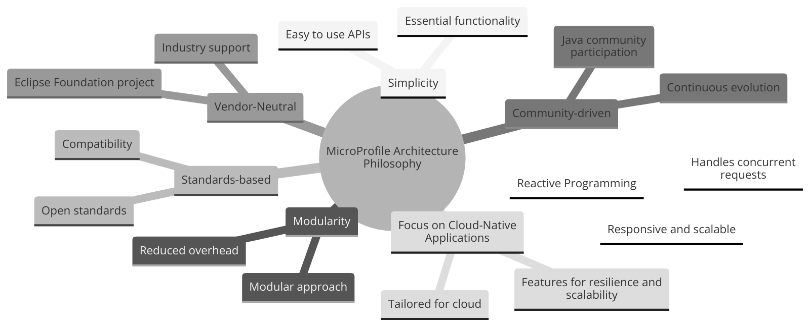

== Chapter 1: Introduction to MicroProfile

=== Introduction 

This section will provide a comprehensive overview of the MicroProfile platform to ensure a deep understanding of its architecture, specifications, and critical features. We will start by understanding the fundamentals of the MicroProfile platform, its purpose, and its place in the broader context of Java enterprise development. It covers its benefits, its relationship with Jakarta EE, and how it supports cloud-native application development.

=== Topics to be covered:
- What is MicroProfile 
- Need for MicroProfile
- Benefits of MicroProfile
- Relationship with Jakarta EE specification 

=== What is MicroProifle

MicroProfile (a.k.a Eclipse MicroProfile) is an open-source specification that facilitates the development of microservices using enterprise Java technologies. It defines a set of APIs and specifications for building modern, scalable, resilient, and efficient applications based on microservices architecture. The primary goal of MicroProfile is to simplify the development process for Java developers, enabling them to create applications optimized for cloud-native development.

A consortium of industry leaders and Java community members, including organizations such as IBM, Red Hat, Payara, Tomitribe, and individual contributors, developed MicroProfile. This collaborative approach ensured that MicroProfile was shaped by diverse experiences and requirements, making it a robust and versatile specification extending Java in cloud-computing domain. 

==== Key Specifications
The table below provides a list of key specifications of MicroProfile along with their descriptions:

Open API
Rest Client
Config
Fault Tolerance
Metrics
JWT Authentication
Health
Jakarta EE 10 Core Profile

[options="header"]
|=======================
|Specification          |Description
|link:https://microprofile.io/specifications/microprofile-config/[Config]                 |It allows applications to configure themselves dynamically by reading configuration data from various sources.
|link:https://microprofile.io/specifications/microprofile-fault-tolerance/[Fault Tolerance]        |Implements patterns like Circuit Breaker, Bulkhead, Retry, Timeout, and Fallback to create resilient microservices.
|link:https://microprofile.io/specifications/microprofile-jwt-auth/[JWT Authentication]     |Defines a standard for using JSON Web Tokens for authentication and authorization in microservices for secure communication.
|link:https://microprofile.io/specifications/microprofile-metrics/[Metrics]                |Enables applications to expose telemetry data to external monitoring systems, providing insights into their performance.
|link:https://microprofile.io/specifications/microprofile-health/[Health Check]           |Allows applications to signal their health and readiness to perform operations, which is crucial for automated recovery in cloud environments.
|link:https://microprofile.io/specifications/microprofile-open-api/[Open API]                |Facilitates the generation of OpenAPI documentation for RESTful services, making API discovery and understanding easier.
|link:https://microprofile.io/specifications/microprofile-telemetry/[Telemetry]| It provides a unified set of APIs, libraries, and tools for collecting, processing, and exporting telemetry data (metrics, traces, and logs) from cloud-native applications and services.
|link:https://microprofile.io/specifications/microprofile-rest-client[Rest Client]            |Defines a type-safe approach to invoke RESTful services over HTTP(S), simplifying the development of HTTP clients.
| link:https://jakarta.ee/specifications/coreprofile/10/[Jakarta EE Core Profile 10] | It is an optimzed Jakarta EE platform, designed specifically for developing microservices and cloud-native Java applications with a reduced set of specifications for a lighter runtime footprint.
|=======================

These specifications solve specific microservices challenges, such as configuration management, fault tolerance, and service monitoring. 

==== Architecture Philosophy 

The architecture of MicroProfile is based on the following core principles with the overall goal of building a lightweight enterprise-grade framework tailored for building cloud-native applications and enabling developers to build and deploy microservices with Java easily: 

- *Simplicity*: MicroProfile APIs are designed to be simple and easy to use. They avoid unnecessary complexity and focus on providing the essential functionality for building microservices.

- *Modularity*: Its modular approach allows developers to use only what they need, reducing the overhead typically associated with enterprise frameworks.

- *Standards-based*: MicroProfile is based on open standards and specifications, ensuring compatibility and consistency across different implementations.

- *Community-driven*: It encourages active participation from the Java community for continuous evolution.

- *Vendor-Neutral*: As an Eclipse Foundation project, MicroProfile is vendor-neutral. It's supported by several industry players, ensuring that no single company controls its direction.

- *Focus on Cloud-Native Applications*: The architecture is specifically tailored for cloud environments. It includes features such as externalized configuration, fault tolerance, health checks, and metrics. These features are essential for developing resilient and scalable cloud-native applications. 

- *Reactive programming*: MicroProfile supports reactive programming, which is a style of programming that is well-suited for building microservices. Reactive applications are responsive and scalable, and they can handle high volumes of concurrent requests.

=== Need for MicroProfile

The emergence of microservices architectures has introduced unique challenges for developers. MicroProfile aims to address these challenges by providing a streamlined and optimized set of APIs APIs tailored explicitly for building and deploying microservices-based applications in Java:

- *Microservices Architecture Adoption*: As the industry shifted towards microservices architecture for its flexibility, scalability, and speed of deployment, there was a growing need for a standard framework tailored to this architectural style, especially in the Java ecosystem.

- *Limitations of Traditional Enterprise Java*: Traditional enterprise Java frameworks, like Java EE (now Jakarta EE), were often seen as too monolithic and heavyweight for microservices. This led to a demand for a more streamlined and microservices-focused framework.

- *Cloud-Native Application Development*: The rise of cloud-native applications required features like external configuration, health checks, and fault tolerance. Existing Java standards did not adequately address these.

- *Community-Driven Innovation*: The Java community saw the need for a platform where they could collaboratively develop and innovate rapidly to keep up with the fast-paced changes in technology and microservice's best practices.

- *Vendor Neutrality and Interoperability*: There was a need for a vendor-neutral framework that could provide standardization across different implementations and environments, ensuring compatibility and avoiding vendor lock-in.

- *Focus on Simplicity and Productivity*: Developers needed a simple and easy-to-understand framework that increased productivity by reducing boilerplate code and focusing on essential microservice functionalities. Well-defined standards and patterns eliminate the need to reinvent the wheel, allowing developers to focus on microservices logic.

- *Integration with Existing Java Ecosystems*: It was crucial to have a framework that could integrate smoothly with existing Java ecosystems like Jakarta EE, leveraging the strengths of these platforms while extending their capabilities to support microservices.

- *Emphasis on Lightweight and Resilient Services*: With the microservices architecture, there's a need for frameworks that support the development of lightweight, resilient, and independently deployable services, which are essential for microservices.

- *Rapid Adaptation to New Trends*: The technology landscape, especially around microservices, is constantly evolving. A framework like MicroProfile, which is community-driven and rapidly evolving, can adapt quickly to these changes, continually incorporating new practices and technologies.

- *Enhanced Observability and Monitoring*: Microservices architectures complicate application monitoring and observability. A framework with built-in support for these capabilities simplifies the management of distributed services.

=== Benefits of MicroProfile
MicroProfile offers several benefits, making it a compelling choice for developing microservices, especially in Java-centric environments. These benefits include:

- *Optimized for Microservices*: MicroProfile is designed explicitly for creating microservices, offering APIs that cater to the unique challenges of this architectural style.

- *Cloud-Native Focus*: The framework includes features such as externalized configuration, health checks, and metrics, which are essential for building and operating cloud-native applications effectively. MicroProfile is inherently designed for cloud-native applications.

- *Open Source and Standards-Based*: As an open-source framework based on open standards, MicroProfile facilitates interoperability and reduces the risk of vendor lock-in.

- *Enhanced Productivity, Rapid Development and Deployment*: MicroProfile simplifies microservices development with a set of standard APIs. With its focus on simplicity and productivity, MicroProfile helps speed up the development and deployment of microservices by providing essential functionalities and reducing boilerplate code.

- *Community-Driven Innovation*: Being community-driven, MicroProfile evolves quickly, incorporating new trends and best practices in microservices development. MicroProfile is backed by a strong Java community, ensuring continuous improvement and support.

- *Vendor Neutrality*: Being vendor-neutral, MicroProfile is supported by a wide range of industry players, which ensures a broad choice of tools and platforms for developers.

- *Compatibility with Jakarta EE*: MicroProfile is complementary to Jakarta EE, enabling developers to leverage the robustness of Jakarta EE while extending its capabilities to support microservices.

- *Lightweight and Modular*: It provides a lightweight model compared to traditional enterprise Java frameworks. Its modularity allows developers to use only the necessary components, reducing the application's footprint and overhead.

- *Scalability*: The framework supports the development of scalable applications, essential for microservices that handle varying loads efficiently.

- *Enhanced Resilience*: MicroProfile includes specifications for fault tolerance patterns like retries, circuit breakers, timeouts, and bulkheads, which are crucial for building resilient services that can withstand network and service failures.

- *Security Features*: MicroProfile's JWT Authentication provides a standardized way to secure microservices, making it easier to implement authentication and authorization.

- *Ease of Testing*: With its lightweight nature and support for advanced features like Rest Client, MicroProfile simplifies the testing of microservices, both in isolation and in integration scenarios.

=== Relationship with Jakarta EE specification 
While Jakarta EE is the broader umbrella under which everything under enterprise Java now falls, MicroProfile specializes in microservices. MicroProfile is not a replacement but rather a supplement to Jakarta EE (formerly Java EE), focusing on microservices-specific features. The two are complementary, with MicroProfile building on the Jakarta EE standards and adding additional capabilities required for microservices architectures. This synergy allows developers to leverage the robustness of Jakarta EE while utilizing MicroProfile for microservices-specific features.

=== Conclusion
In this section, we explored the MicroProfile platform in detail, laying the foundation for understanding how it revolutionizes the development of microservices using Java. We started by defining MicroProfile, emphasizing its role as an open-source specification tailored for microservices development. Key contributions from industry leaders and community members have positioned MicroProfile as a pivotal technology in the Java ecosystem, especially for cloud-native application development. We delved into the essential specifications of MicroProfile, each playing a critical role in addressing specific challenges in microservices development, from configuration management to service resilience. As we move forward in this tutorial, we will delve deeper into each specification and discover how to effectively implement MicroProfile in real-world Java applications. 
